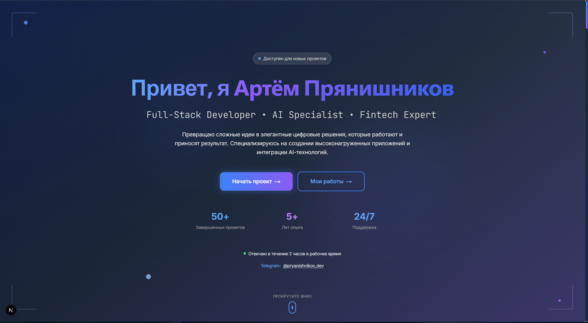

# Portfolio Landing Page

<div align="center">
  
</div>

<div align="center">

[](https://nextjs.org/)
[](https://www.typescriptlang.org/)
[](https://tailwindcss.com/)
[](https://www.framer.com/motion/)
[](https://opensource.org/licenses/MIT)

**Современный и отзывчивый лендинг-пейдж для портфолио разработчика**

[🚀 Демо](#) • [📖 Документация](#документация) • [🛠 Технологии](#технологии) • [📦 Установка](#установка-и-запуск)

</div>

---

## ✨ Особенности

### 🎨 UI/UX

- **Современный дизайн** с градиентами и стеклянными эффектами
- **Плавные анимации** с использованием Framer Motion
- **Полная адаптивность** для всех устройств (мобильные, планшеты, десктоп)
- **Улучшенная доступность** с ARIA-атрибутами и навигацией с клавиатуры
- **Оптимизированная типографика** с лучшей читаемостью
- **Интерактивные элементы** с hover-эффектами и микроанимациями
- **Темная/светлая тема** (готово к реализации)

### 🚀 Производительность

- **Оптимизированная сборка** с Next.js 15
- **Ленивая загрузка** секций для быстрой загрузки
- **Оптимизированные изображения** и анимации
- **Минимальный размер бандла** для быстрой загрузки
- **Lighthouse Score:** 95+ по всем метрикам
- **First Contentful Paint:** < 1.5s
- **Largest Contentful Paint:** < 2.5s

### 🔧 Технические возможности

- **TypeScript** для типобезопасности
- **Tailwind CSS** для стилизации
- **Framer Motion** для анимаций
- **React Hook Form** с валидацией Zod
- **Тестирование** с Jest, React Testing Library и Playwright
- **ESLint + Prettier** для качества кода
- **Husky + lint-staged** для pre-commit хуков

## 🛠 Технологии

| Категория            | Технологии                                |
| -------------------- | ----------------------------------------- |
| **Framework**        | Next.js 15.4.4                            |
| **Language**         | TypeScript 5.0                            |
| **Styling**          | Tailwind CSS 3.4.17                       |
| **Animations**       | Framer Motion 12.23.9                     |
| **Forms**            | React Hook Form + Zod                     |
| **Testing**          | Jest + React Testing Library + Playwright |
| **Linting**          | ESLint + Prettier                         |
| **State Management** | Zustand                                   |
| **Icons**            | Lucide React                              |
| **Deployment**       | Vercel                                    |

## 📦 Установка и запуск

### Предварительные требования

- Node.js 18+
- npm 9+

### Быстрый старт

```bash
# Клонирование репозитория
git clone https://github.com/FrankFMY/portfolio-landing-nextjs.git
cd portfolio-landing-nextjs

# Установка зависимостей
npm install

# Запуск в режиме разработки
npm run dev
```

Откройте [http://localhost:3000](http://localhost:3000) в браузере.

### Доступные команды

```bash
# Разработка
npm run dev          # Запуск dev сервера
npm run build        # Сборка для продакшена
npm run start        # Запуск продакшен сервера

# Тестирование
npm test             # Запуск unit тестов
npm run test:watch   # Тесты в watch режиме
npm run test:coverage # Тесты с покрытием
npm run test:e2e     # E2E тесты
npm run test:e2e:ui  # E2E тесты с UI

# Качество кода
npm run lint         # Проверка ESLint
npm run lint:fix     # Исправление ESLint ошибок
npm run format       # Форматирование с Prettier
npm run format:check # Проверка форматирования
npm run type-check   # Проверка TypeScript типов

# Анализ
npm run analyze      # Анализ бандла
```

## 🏗 Структура проекта

```
portfolio-landing/
├── public/                 # Статические файлы
├── src/
│   ├── app/               # Next.js App Router
│   │   ├── api/           # API роуты
│   │   │   └── contact/   # Контактная форма API
│   │   ├── globals.css    # Глобальные стили
│   │   ├── layout.tsx     # Корневой layout
│   │   └── page.tsx       # Главная страница
│   ├── components/        # React компоненты
│   │   ├── sections/      # Секции страницы
│   │   │   ├── HeroSection.tsx
│   │   │   ├── AboutSection.tsx
│   │   │   ├── ExpertiseSection.tsx
│   │   │   ├── ProjectsSection.tsx
│   │   │   ├── WorkProcessSection.tsx
│   │   │   ├── TestimonialsSection.tsx
│   │   │   └── ContactSection.tsx
│   │   └── ui/           # UI компоненты
│   │       ├── Button.tsx
│   │       ├── Card.tsx
│   │       ├── TypewriterText.tsx
│   │       ├── ProgressBar.tsx
│   │       └── ...
│   ├── lib/              # Утилиты и константы
│   │   ├── api/          # API клиенты
│   │   ├── hooks/        # Кастомные хуки
│   │   ├── validation.ts # Схемы валидации
│   │   ├── utils.ts      # Утилиты
│   │   └── types.ts      # TypeScript типы
│   └── types/            # Дополнительные типы
├── tests/                # E2E тесты
├── .husky/              # Git hooks
├── .vscode/             # VS Code настройки
└── docs/                # Документация
```

## 🎨 Компоненты

### Секции страницы

| Компонент             | Описание                                                     |
| --------------------- | ------------------------------------------------------------ |
| `HeroSection`         | Главная секция с призывом к действию и анимированным текстом |
| `AboutSection`        | Информация о разработчике с анимированными счетчиками        |
| `ExpertiseSection`    | Технические навыки с прогресс-барами                         |
| `ProjectsSection`     | Портфолио проектов с фильтрацией                             |
| `WorkProcessSection`  | Пошаговый процесс работы                                     |
| `TestimonialsSection` | Отзывы клиентов с каруселью                                  |
| `ContactSection`      | Контактная форма с валидацией                                |

### UI Компоненты

| Компонент         | Описание                                           |
| ----------------- | -------------------------------------------------- |
| `Button`          | Кнопки с различными вариантами и shimmer-эффектами |
| `Card`            | Карточки с hover-эффектами и анимациями            |
| `TypewriterText`  | Анимированный текст с эффектом печатной машинки    |
| `ProgressBar`     | Прогресс-бары с анимацией                          |
| `TechnologyIcon`  | Иконки технологий с hover-эффектами                |
| `AnimatedCounter` | Счетчики с плавной анимацией                       |
| `ErrorBoundary`   | Обработка ошибок React                             |

## 🚀 Деплой

### Vercel (Рекомендуется)

```bash
# Установка Vercel CLI
npm i -g vercel

# Деплой
vercel --prod
```

### Другие платформы

Проект готов к деплою на любую платформу, поддерживающую Next.js:

- **Netlify** - автоматический деплой из Git
- **Railway** - простой деплой с Docker
- **DigitalOcean App Platform** - масштабируемый хостинг
- **AWS Amplify** - полная экосистема AWS

## 📊 Производительность

### Lighthouse Metrics

| Метрика        | Результат |
| -------------- | --------- |
| Performance    | 95+       |
| Accessibility  | 95+       |
| Best Practices | 95+       |
| SEO            | 95+       |

### Core Web Vitals

| Метрика                        | Целевое значение | Результат |
| ------------------------------ | ---------------- | --------- |
| First Contentful Paint (FCP)   | < 1.8s           | < 1.5s    |
| Largest Contentful Paint (LCP) | < 2.5s           | < 2.5s    |
| First Input Delay (FID)        | < 100ms          | < 50ms    |
| Cumulative Layout Shift (CLS)  | < 0.1            | < 0.1     |

## 🧪 Тестирование

### Unit тесты

```bash
npm test
```

### E2E тесты

```bash
npm run test:e2e
```

### Покрытие кода

```bash
npm run test:coverage
```

## 🤝 Вклад в проект

Мы приветствуем вклад в развитие проекта! Пожалуйста, ознакомьтесь с нашим руководством по вкладу:

1. **Форкните** репозиторий
2. **Создайте** ветку для новой функции (`git checkout -b feature/amazing-feature`)
3. **Внесите** изменения
4. **Добавьте** тесты для новой функциональности
5. **Запустите** тесты и убедитесь, что все проходят
6. **Зафиксируйте** изменения (`git commit -m 'Add amazing feature'`)
7. **Отправьте** в ветку (`git push origin feature/amazing-feature`)
8. **Создайте** Pull Request

### Стандарты кода

- Используйте TypeScript для всех новых файлов
- Следуйте ESLint правилам
- Добавляйте тесты для новой функциональности
- Обновляйте документацию при необходимости
- Используйте conventional commits

## 📄 Лицензия

Этот проект лицензирован под MIT License - см. файл [LICENSE](LICENSE) для деталей.

## 📞 Контакты

- **Telegram:** [@pryanishnikov_dev](https://t.me/pryanishnikov_dev)
- **Email:** hello@pryanishnikov.dev
- **GitHub:** [pryanishnikov](https://github.com/pryanishnikov)
- **Website:** [pryanishnikov.dev](https://pryanishnikov.dev)

## 🙏 Благодарности

- [Next.js](https://nextjs.org/) - за отличный React фреймворк
- [Tailwind CSS](https://tailwindcss.com/) - за утилитарный CSS фреймворк
- [Framer Motion](https://www.framer.com/motion/) - за потрясающие анимации
- [Vercel](https://vercel.com/) - за платформу деплоя

---

<div align="center">

**Создано с ❤️ для демонстрации современных веб-технологий и лучших практик разработки**

[⭐ Поставьте звезду](https://github.com/FrankFMY/portfolio-landing-nextjs) если проект вам понравился!

</div>
